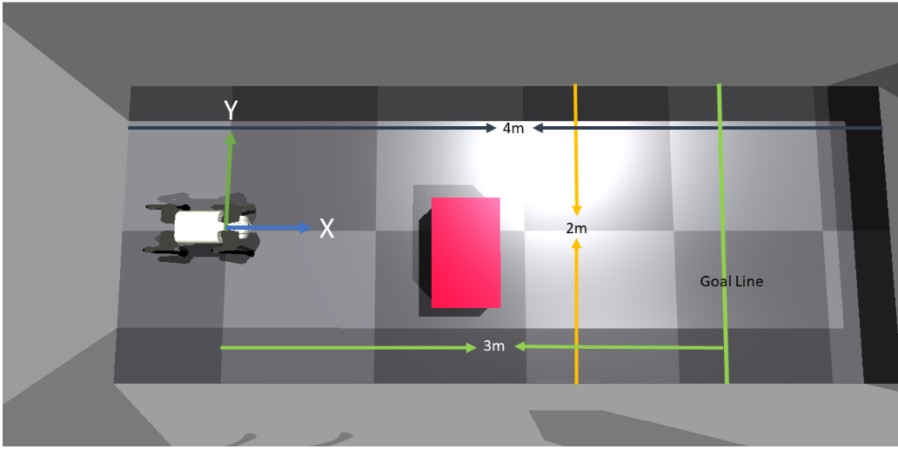

# Walk-these-ways (CS562: Advanced Robotics)

## Introduction
This project, part of CS562: Advanced Robotics, aims to train and demonstrate a robotic dog's ability to navigate and avoid obstacles. It leverages the Isaac Gym Simulator and the Unitree Go1 robot, focusing on achieving precise locomotion and navigation in a virtual environment. The ultimate goal is to enable the robot dog to move from point A to point B while avoiding collisions, simulating real-world scenarios where such technology could be vital in search and rescue, agriculture, logistics, and healthcare.

## Phase 1: Robot Locomotion
### Overview
Phase 1 aims to train a velocity-conditioned neural network policy enabling the robot to walk at commanded longitudinal, lateral, and angular velocities. Sensory data includes joint positions, velocities, and orientation of the gravity vector, essential for the robot's stable movement.

### Implementation
The phase begins with setting up the Isaac Gym simulator and cloning the 'walk-these-ways' repository. The main task is to train the robot to follow commanded velocities within a specified range, familiarizing participants with the simulator, code base, and the robot's functionality.

### Results
<video width="640" height="360" controls>
  <source src="Assets/phase1.mp4" type="video/mp4">
  Your browser does not support the video tag.
</video>

## Phase 2: Robot Navigation within Walls
### Overview
Building on Phase 1, Phase 2 focuses on navigating a walled corridor without colliding. This involves training another policy using reinforcement learning, Actor-Critic Proximal Policy algorithm (PPO), providing velocity commands to the locomotion policy.

### Implementation
The task involves setting up an environment with walls, implementing a Navigator class, and employing the Actor-Critic Proximal Policy algorithm for training. The challenge is to navigate the robot from a start to a goal position, varying the initial position and orientation of the robot.

### Results
- [Dog walking towards the goal line (Fixed spawning)](Assets/phase2StaticInit.mp4)
- [Dog walking towards the goal line (Backward - Random spawning)](Assets/phase2RandomInit1.mp4)
- [Dog realigning itself towards the goal line (Forward - Random spawning)](Assets/phase2RandomInit2.mp4)

## Phase 3: Robot Locomotion with Obstacle Avoidance (In progress)
### Overview
The final phase introduces obstacle avoidance to the navigation policy, considering the obstacle's location and size.

### Implementation
An immovable obstacle is added to the existing environment, and the policy is trained to avoid it. The input space includes the obstacle's location and size.

### Diagram

### Results
- [Obstacle avoidance result 1](Assets/phase3_1.mp4)
- [Obstacle avoidance result 2](Assets/phase3_2.mp4)
- [Obstacle avoidance result 3](Assets/phase3_3.mp4)
